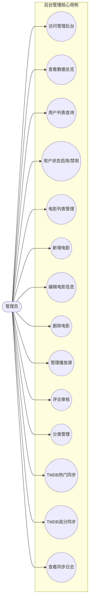

# 4K影视资源网系统 - 管理员用例图

## 管理员用例图（Mermaid flowchart实现）

```mermaid
flowchart LR
    Admin([管理员])

    subgraph A[后台管理核心用例]
        AC1((访问管理后台))
        AC2((查看数据总览))
        AC3((用户列表查询))
        AC4((用户状态启用/禁用))
        AC5((电影列表管理))
        AC6((新增电影))
        AC7((编辑电影信息))
        AC8((删除电影))
        AC9((管理播放源))
        AC10((评论审核))
        AC11((分类管理))
        AC12((TMDB热门同步))
        AC13((TMDB高分同步))
        AC14((查看同步日志))
    end

    Admin --> AC1
    Admin --> AC2
    Admin --> AC3
    Admin --> AC4
    Admin --> AC5
    Admin --> AC6
    Admin --> AC7
    Admin --> AC8
    Admin --> AC9
    Admin --> AC10
    Admin --> AC11
    Admin --> AC12
    Admin --> AC13
    Admin --> AC14
```

## 说明

- 该图覆盖管理员从后台入口、数据概览到内容治理、播放源维护、同步管理和日志追踪的完整流程。
- 电影管理与播放源管理共同支撑平台内容维护能力。
- TMDB 同步与日志查询用于形成可审计、可追踪的运营闭环。
