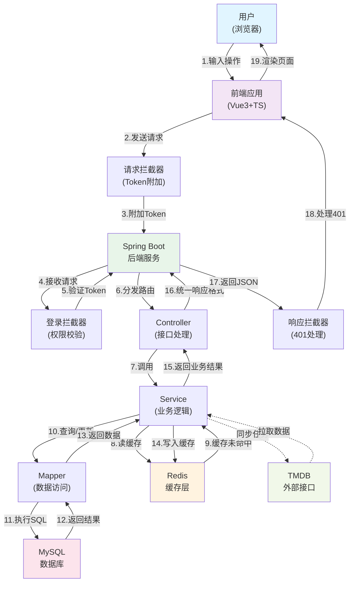

# 4K影视资源网系统 - 数据流图

## 系统数据流交互图（Mermaid格式）



## 数据流详细说明

### 1. 请求阶段（步骤1-4）
- **用户操作**：用户在浏览器中与应用交互，触发各类操作（搜索、浏览、播放等）
- **前端处理**：Vue3应用捕获用户事件，准备HTTP请求
- **请求拦截**：Axios请求拦截器自动在`Authorization`头添加`Bearer token`
- **后端接收**：Spring Boot服务接收HTTP请求

### 2. 权限验证阶段（步骤5）
- **拦截器校验**：LoginInterceptor对所有请求进行token验证
- **验证内容**：
  - Token合法性检查
  - Token过期时间验证
  - 用户身份信息解析
  - 权限级别判断（普通用户vs管理员）
- **放行规则**：公开接口（登录、注册、电影查询）不需token；私有接口必须token合法

### 3. 业务处理阶段（步骤6-7）
- **路由分发**：Controller根据请求路径分发到对应的业务处理器
- **参数校验**：Controller进行非空、格式、权限的三层校验
- **业务调用**：Controller调用Service执行核心业务逻辑

### 4. 数据访问阶段（步骤8-14）
- **缓存查询**（步骤8-9）：
  - Service优先查询Redis缓存
  - 缓存命中则直接返回，避免数据库查询
  - 缓存未命中则继续查询数据库
- **数据库操作**（步骤10-13）：
  - Mapper构建SQL语句
  - 执行SQL查询或更新
  - MySQL返回结果集
  - Mapper将结果转换为Java对象
- **缓存写入**（步骤14）：
  - 将查询结果写入Redis
  - 设置过期时间（详情1小时、列表30分钟、搜索5分钟）

### 5. 响应阶段（步骤15-19）
- **业务结果返回**：Service将结果返回给Controller
- **响应格式统一**：Controller构建统一的JSON响应体
  ```json
  {
    "code": 200,
    "message": "success",
    "data": {...}
  }
  ```
- **响应拦截处理**：ResponseHandler处理特殊响应码
  - 401: 清理本地登录态，跳转登录页
  - 403: 提示"无权限"
  - 其他错误: 显示错误提示
- **前端渲染**：Vue3应用根据响应结果更新UI并渲染页面

### 6. 异步同步流程（虚线）
- **TMDB同步**：管理员触发TMDB数据同步
- **数据拉取**：Service通过HTTP调用TMDB API
- **后台处理**：
  - 分批拉取电影数据
  - 字段提取与映射
  - 本地分类关联
  - 播放源自动生成
  - 数据库入库
  - 日志记录
  - Redis缓存清理

## 关键机制

### 缓存策略
| 类型 | 缓存键 | 过期时间 | 清理时机 |
| --- | --- | --- | --- |
| 电影详情 | `movie:detail:{id}` | 1小时 | TMDB同步后 |
| 热门列表 | `movie:hot:{page}:{size}` | 30分钟 | TMDB同步后 |
| 搜索结果 | `movie:search:{keyword}:{page}:{size}` | 5分钟 | TMDB同步后 |

### 异常处理
| 异常类型 | 处理方式 | 用户提示 |
| --- | --- | --- |
| 未登录访问受保护接口 | 返回401 | "登录已过期，请重新登录" |
| 普通用户访问管理接口 | 返回403 | "无管理员权限" |
| 数据库查询失败 | 返回500 | "服务器错误，请稍后重试" |
| 缓存连接失败 | 降级直接查库 | 用户无感知 |

## 性能优化点

1. **缓存分层**：优先查缓存再查库，显著降低数据库压力
2. **分页查询**：列表接口统一分页，避免一次加载过多数据
3. **异步同步**：TMDB同步不阻塞用户请求，后台异步处理
4. **链接池**：Mapper层使用连接池，提升并发处理能力
5. **索引优化**：关键字段建立索引，加速检索性能

