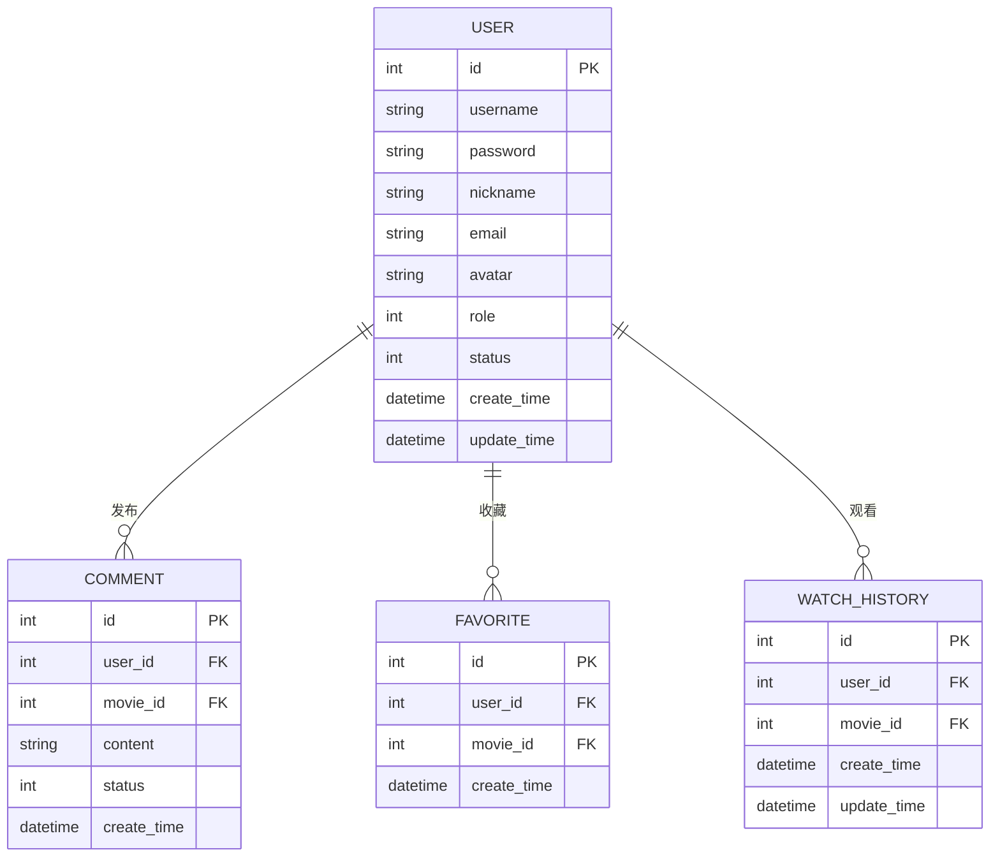
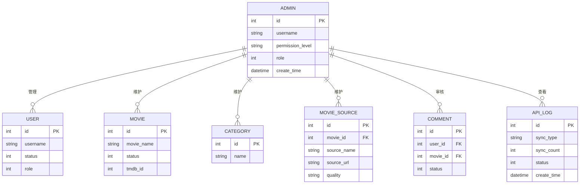

# 4K影视资源网系统 - 用户与管理员ER图

## 用户ER图

## 管理员ER图

## 关键关系说明

### 用户ER图

| 关系 | 类型 | 说明 |
| --- | --- | --- |
| User-Comment | 1对多 | 一个用户可发表多条评论 |
| User-Favorite | 1对多 | 一个用户可收藏多部电影 |
| User-WatchHistory | 1对多 | 一个用户可产生多条观看记录 |

### 管理员ER图

| 关系 | 类型 | 说明 |
| --- | --- | --- |
| Admin-User | 1对多 | 一个管理员可管理多个普通用户 |
| Admin-Movie | 1对多 | 一个管理员可维护多部电影 |
| Admin-Category | 1对多 | 一个管理员可维护多个分类 |
| Admin-MovieSource | 1对多 | 一个管理员可维护多个播放源 |
| Admin-Comment | 1对多 | 一个管理员可审核多条评论 |
| Admin-ApiLog | 1对多 | 一个管理员可查看多条同步日志 |

### 图示说明

- 用户ER图直接对应 `User.java` 及其相关行为表，便于说明普通用户业务闭环。
- 管理员ER图是根据 `AdminController` 的权限校验和后台管理接口抽象出来的逻辑图，代码里通过 `role=1` 区分管理员。
- 这两个图都保持简化，适合论文展示，不展开数据库全部字段。

