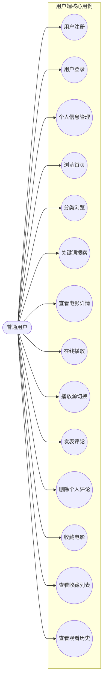

# 4K影视资源网系统 - 用户用例图

## 用户用例图（Mermaid flowchart实现）

```mermaid
flowchart LR
    User([普通用户])

    subgraph U[用户端核心用例]
        UC1((用户注册))
        UC2((用户登录))
        UC3((个人信息管理))
        UC4((浏览首页))
        UC5((分类浏览))
        UC6((关键词搜索))
        UC7((查看电影详情))
        UC8((在线播放))
        UC9((播放源切换))
        UC10((发表评论))
        UC11((删除个人评论))
        UC12((收藏电影))
        UC13((查看收藏列表))
        UC14((查看观看历史))
    end

    User --> UC1
    User --> UC2
    User --> UC3
    User --> UC4
    User --> UC5
    User --> UC6
    User --> UC7
    User --> UC8
    User --> UC9
    User --> UC10
    User --> UC11
    User --> UC12
    User --> UC13
    User --> UC14
```

## 说明

- 该图覆盖普通用户从注册登录到播放、互动、收藏和历史管理的完整闭环。
- 在线播放与播放源切换共同构成影片消费核心场景。
- 收藏、评论和历史记录用于支撑个性化体验与行为沉淀。
