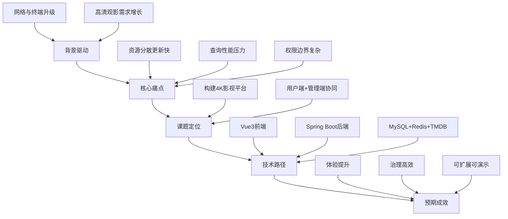
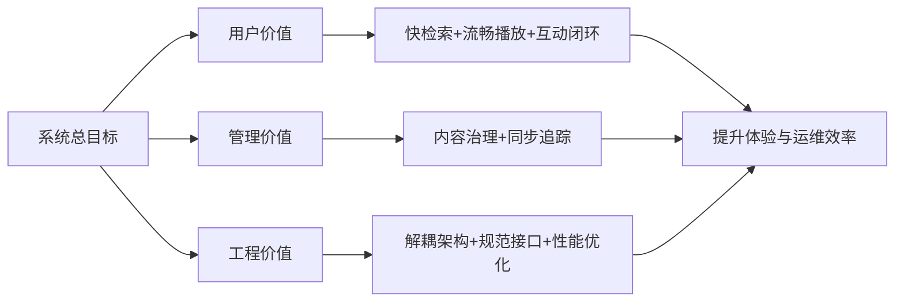
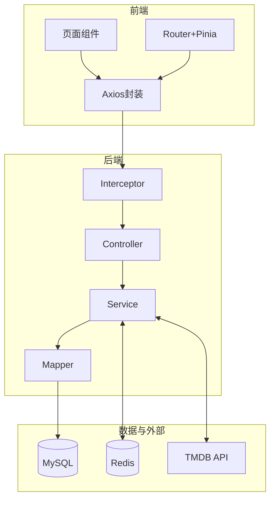
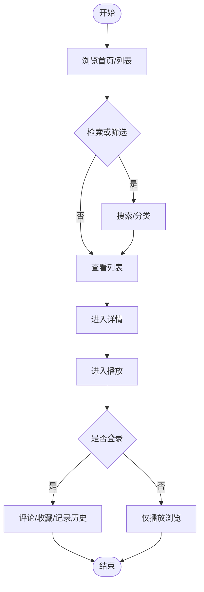
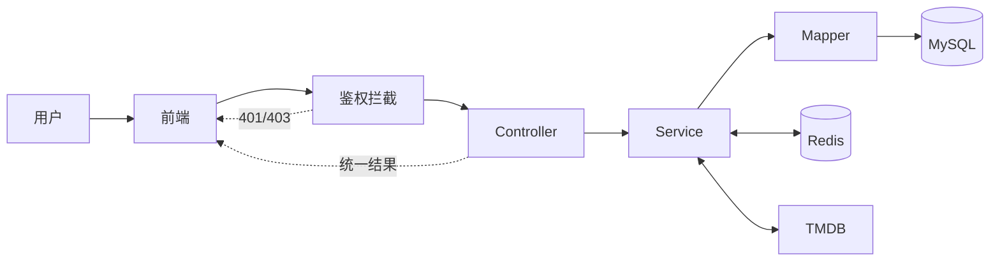
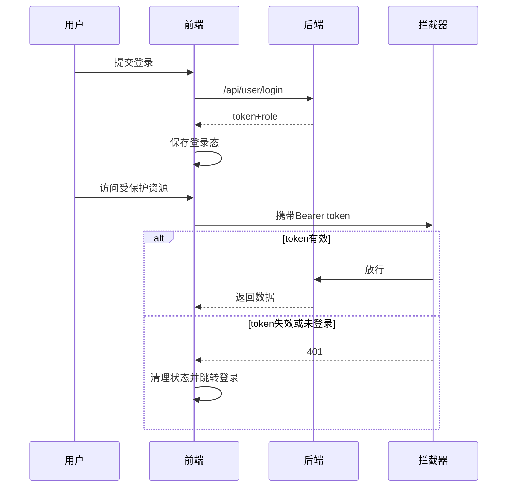
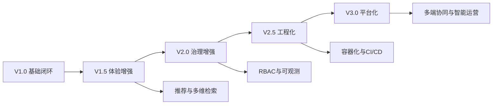

# Thesis Figures Mermaid (V2 Compact)

## 图1-1 课题研究背景与问题定位示意图

```mermaid
flowchart TB
  A[背景驱动] --> B[核心痛点]
  B --> C[课题定位]
  C --> D[技术路径]
  D --> E[预期成效]

  A1[网络与终端升级] --> A
  A2[高清观影需求增长] --> A

  B1[资源分散更新快] --> B
  B2[查询性能压力] --> B
  B3[权限边界复杂] --> B

  C1[构建4K影视平台] --> C
  C2[用户端+管理端协同] --> C

  D1[Vue3前端] --> D
  D2[Spring Boot后端] --> D
  D3[MySQL+Redis+TMDB] --> D

  E1[体验提升] --> E
  E2[治理高效] --> E
  E3[可扩展可演示] --> E
```

## 图1-2 系统建设目标与价值示意图

```mermaid
flowchart LR
  G[系统总目标]

  U[用户价值]
  M[管理价值]
  P[工程价值]

  U1[快检索+流畅播放+互动闭环]
  M1[内容治理+同步追踪]
  P1[解耦架构+规范接口+性能优化]

  G --> U --> U1
  G --> M --> M1
  G --> P --> P1

  U1 --> R[综合成效]
  M1 --> R
  P1 --> R
  R[提升体验与运维效率]
```

## 图2-1 前端技术栈与模块关系图

```mermaid
flowchart TB
  subgraph FE[前端]
    FE1[页面组件]
    FE2[Router+Pinia]
    FE3[Axios封装]
  end

  subgraph BE[后端]
    BE1[Controller]
    BE2[Service]
    BE3[Interceptor]
    BE4[Mapper]
  end

  subgraph DS[数据与外部]
    DB[(MySQL)]
    RD[(Redis)]
    TM[TMDB API]
  end

  FE1 --> FE3
  FE2 --> FE3
  FE3 --> BE3 --> BE1 --> BE2 --> BE4 --> DB
  BE2 <--> RD
  BE2 <--> TM
```

## 图3-1 用户端核心业务流程图

```mermaid
flowchart TD
  S([开始]) --> A[浏览首页/列表]
  A --> B{检索或筛选}
  B -- 是 --> C[搜索/分类]
  B -- 否 --> D[查看列表]
  C --> D
  D --> E[进入详情]
  E --> F[进入播放]
  F --> G{是否登录}
  G -- 是 --> H[评论/收藏/记录历史]
  G -- 否 --> I[仅播放浏览]
  H --> J([结束])
  I --> J
```

## 图4-1 系统总体架构图

```mermaid
flowchart LR
  U[用户] --> F[前端]
  F --> I[鉴权拦截]
  I --> C[Controller]
  C --> S[Service]
  S --> M[Mapper]
  M --> DB[(MySQL)]
  S <--> RD[(Redis)]
  S <--> TM[TMDB]
  I -.401/403.-> F
  C -.统一结果.-> F
```

## 图5-1 用户登录与权限控制实现流程图

```mermaid
sequenceDiagram
  participant U as 用户
  participant FE as 前端
  participant BE as 后端
  participant INT as 拦截器

  U->>FE: 提交登录
  FE->>BE: /api/user/login
  BE-->>FE: token+role
  FE->>FE: 保存登录态

  U->>FE: 访问受保护资源
  FE->>INT: 携带Bearer token
  alt token有效
    INT->>BE: 放行
    BE-->>FE: 返回数据
  else token失效或未登录
    INT-->>FE: 401
    FE->>FE: 清理状态并跳转登录
  end
```

## 图6-1 系统后续迭代演进路线图

```mermaid
flowchart LR
  V1[V1.0 基础闭环] --> V2[V1.5 体验增强]
  V2 --> V3[V2.0 治理增强]
  V3 --> V4[V2.5 工程化]
  V4 --> V5[V3.0 平台化]

  V2 --> A[推荐与多维检索]
  V3 --> B[RBAC与可观测]
  V4 --> C[容器化与CI/CD]
  V5 --> D[多端协同与智能运营]
```
